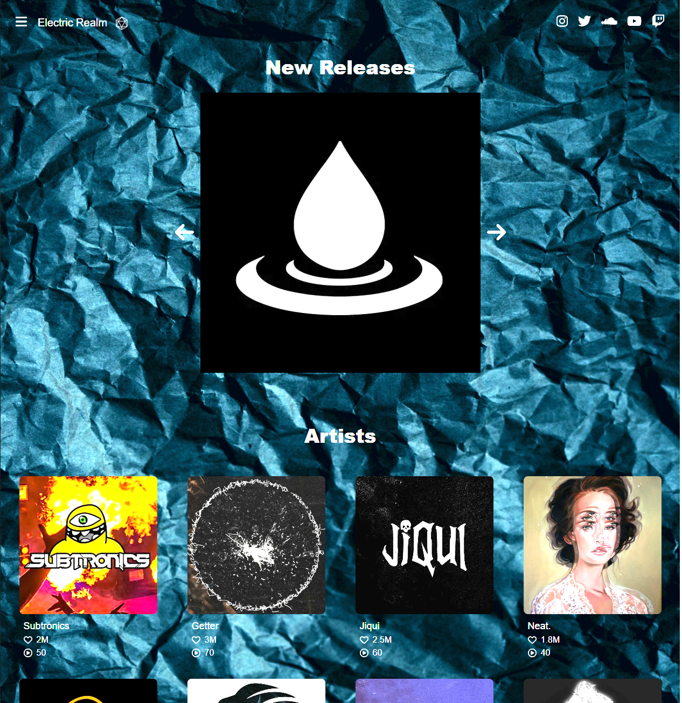

<!-- img src="" width="100%"> -->
<h1 align="center">Hi 👋, I'm Diego or just D</h1>
<h3 align="center">A software engineer passionate about AI</h3>

<!--

  

-->

  
  
  <!-- 
  
  -->
  

- 🔭 I'm currently working on **Meeting more developers, a local music label's
website, and coding tutorials for my blog** - 🌱 I'm currently learning
**Golang, Machine Learning, AWS Cloud services** - 👯 I'm looking to collaborate
on **Any Hackathons, AI related projects, or React / Next JS/ React Native
projects with Golang backends.**

<!-- - 🤝 I'm looking for help with **Connecting NEXT Auth with Firebase Adapter** -->

- 👨‍💻 All of my projects are available at
[http://www.digitaldiego.xyz/](http://www.digitaldiego.xyz/) - 📫 How to reach
me: **diegoespinowork@gmail.com or LinkedIn** - ⚡ Fun facts: **I speak English,
Spanish and I am learning Japanese. I love anime and all kinds of films. I am
also learning how to play the piano, and love to produce Bass music in
Ableton!**

<h3 align="center">Connect with me:</h3>

  <!--  -->
  

<h3 align="center">Languages and Tools:</h3>

  
  
  
  
  
  
  
  
  
  
  
  

<!-- 

 -->

<!--

&nbsp;

-->

<!-- 

 -->

<h1 align="center">Projects</h1>

<table bordercolor="#66b2b2">
  <tr>
    <td width="50%" valign="top">
      <h3 align="center">My Portfolio</h3>
       
      
       
      

        
      

      
My Personal Portfolio showing my projects.

    </td>
    <td width="50%" valign="top">
      <h3 align="center">AI Marketing Text Generator</h3>
       
      
       
      

        
      

      

        <strong
          >🚀 Production-ready starter kit with React frontend (Vite,
          TailwindCSS, ShadCN UI) and Go backend (Fiber, GORM). Includes Docker,
          testing, CI/CD, and live demo. Perfect for rapid full-stack
          development!</strong
        >
      

    </td>
  </tr>

  <tr>
    <td width="50%" valign="top">
      <h3 align="center">The Daily Disco</h3>
       
      

        
      

       
      

        
      

      

        <strong
          >Social media site where users can post AI generate images and also
          hosts AI tutorials.</strong
        >
      

    </td>
    <td width="50%" valign="top">
      <h3 align="center">Electric Realm</h3>
       
      
       
      

        
      

      
A place to discover, share, and talk all things sound

    </td>
  </tr>
</table>

<!--

  
  
  
  

<!--

  
  
  
  

-->
