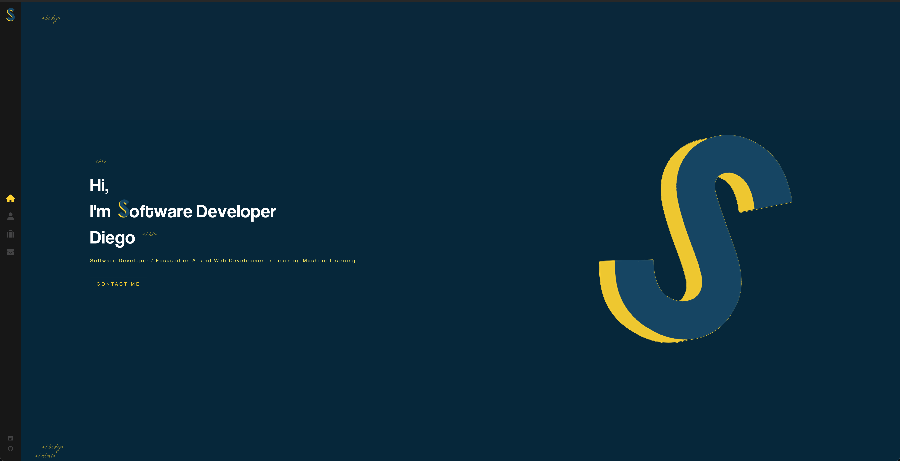
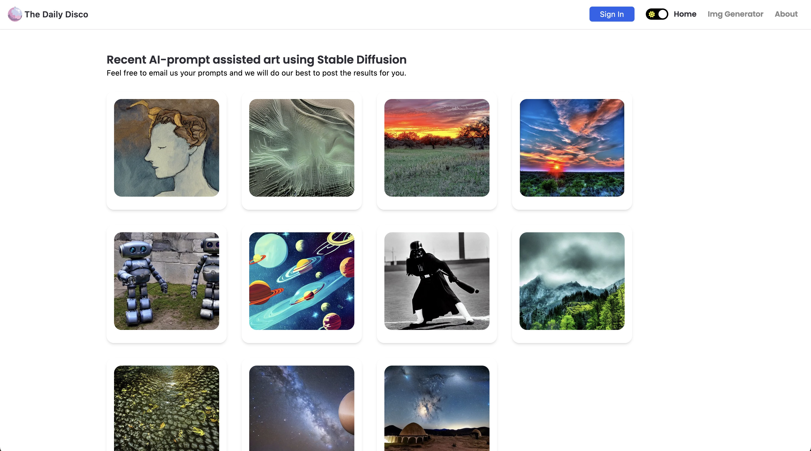

<h1 align="center">Hi 👋, I'm Diego (D)</h1>
<h3 align="center">Software Engineer | AI Enthusiast | Full-Stack Developer</h3>

  
  
  
  

---

<h2>🚀 About Me</h2>

I'm a passionate full-stack developer with a deep interest in AI and modern web technologies. I love building scalable applications and contributing to the open-source community.

<ul>
  <li>🔭 <strong>Currently working on:</strong> Meeting more developers, a local music label's website, and coding tutorials for my blog</li>
  <li>🌱 <strong>Currently learning:</strong> Golang, Machine Learning, AWS Cloud Services</li>
  <li>👯 <strong>Looking to collaborate on:</strong> Hackathons, AI projects, React/Next.js/React Native with Golang backends</li>
  <li>💬 <strong>Ask me about:</strong> React, Node.js, Python, AI/ML, or anything tech-related</li>
  <li>📫 <strong>Reach me:</strong> diegoespinowork@gmail.com</li>
  <li>🌍 <strong>Languages:</strong> English, Spanish, Learning Japanese</li>
  <li>🎵 <strong>Fun fact:</strong> I produce Bass music in Ableton and I'm learning piano!</li>
</ul>

---

<h2>🛠️ Tech Stack</h2>

<h3>Frontend</h3>

  
  
  
  
  

<h3>Backend</h3>

  
  
  
  

<h3>Database & Cloud</h3>

  
  
  

<h3>Tools & Others</h3>

  
  
  

---

<h2>🌟 Featured Projects</h2>

<table>
  <tr>
    <td width="50%" valign="top">
      <h3 align="center">🚀 React + Golang Starter Kit</h3>
      
<strong>Production-ready full-stack template</strong>

       
      
       
      

        
        
      

      
<strong>Tech:</strong> React (Vite), TailwindCSS, ShadCN UI, Go (Fiber), GORM

      
<strong>Features:</strong> Docker, Testing, CI/CD, Live Demo

    </td>
    <td width="50%" valign="top">
      <h3 align="center">🎨 Portfolio Website</h3>
      
<strong>Personal portfolio showcasing projects and skills</strong>

       
      
       
      

        
        
      

      
<strong>Tech:</strong> React, Modern UI/UX

      
<strong>Features:</strong> Responsive design, Project showcase, Contact form

    </td>
  </tr>
  
  <tr>
    <td width="50%" valign="top">
      <h3 align="center">🎵 The Daily Disco</h3>
      
<strong>AI-powered social media platform</strong>

       
      
       
      

        
        
      

      
<strong>Tech:</strong> React, Node.js, AI Integration

      
<strong>Features:</strong> AI image generation, Tutorials, Social features

    </td>
    <td width="50%" valign="top">
      <h3 align="center">📸 Photography Portfolio Template</h3>
      
<strong>Open-source portfolio for photographers</strong>

       
      
       
      

        
        
      

      
<strong>Tech:</strong> Modern web technologies

      
<strong>Features:</strong> Gallery showcase, Responsive design, Easy customization

    </td>
  </tr>
</table>

---

<h2>📊 GitHub Stats</h2>

  

  

  

---

<h2>🤝 Let's Connect!</h2>

I'm always interested in collaborating on exciting projects, especially those involving:

<ul>
  <li><strong>AI/Machine Learning applications</strong></li>
  <li><strong>Full-stack web development</strong></li>
  <li><strong>Open-source contributions</strong></li>
  <li><strong>Hackathons and coding challenges</strong></li>
</ul>

  

---

  <i>"Code is poetry written in logic"</i>

  

